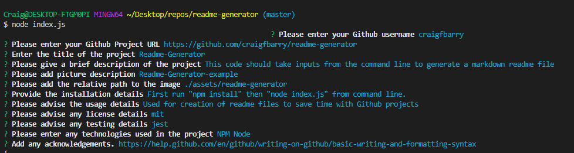

# 
Readme Generator

 Create a good ReadMe markdown file from text inputs

*****
## 
Table of Contents

* [Installation](https://github.com/craigfbarry/readme-generator#installation)

* [Usage](https://github.com/craigfbarry/readme-generator#usage)

* [LIcense](https://github.com/craigfbarry/readme-generator#license)

* [Contributing](https://github.com/craigfbarry/readme-generator#contributing)

* [Tests](https://github.com/craigfbarry/readme-generator#testing-framework)

* [Technologies Used](https://github.com/craigfbarry/readme-generator#technologies-used)

* [Author](https://github.com/craigfbarry/readme-generator#author)

* [Github URL](https://github.com/craigfbarry/readme-generator#github)

* [Acknowledgements](https://github.com/craigfbarry/readme-generator#acknowledgements)

*****

#### Installation

        Run npm install then run node index.js from command line

#### Usage

Used in conjunction with Github to save time creating repositories

#### License

#### Contributing

@joeBloggs

#### Testing framework

        Jest

#### Technologies used

        Node NPM inquirer Axios

#### Author

[@craigfbarry](https://github.com/craigfbarry/)

#### Github URL

https://github.com/craigfbarry/readme-generator

#### Acknowledgements

https://help.github.com/en/github/writing-on-github/basic-writing-and-formatting-syntax

    